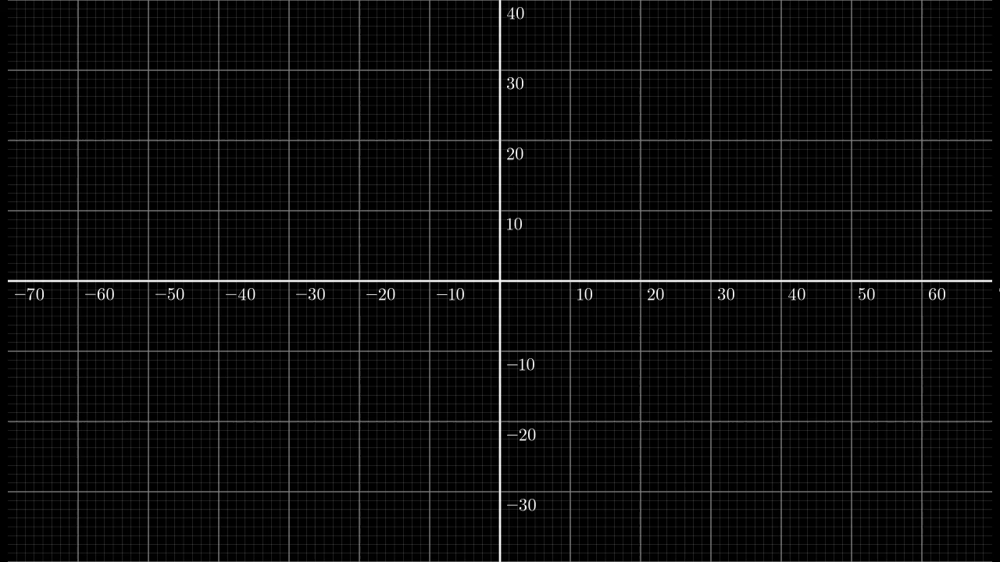

# 离散傅里叶变换 (DFT) 讲解与可视化

## 📖 目录
1. [傅里叶变换的简介](#傅里叶变换的简介)
2. [如何将平面点转换为正余弦函数](#如何将平面点转换为正余弦函数)
3. [代码实现与可视化视频](#代码实现与可视化视频)
4. [运行指南](#运行指南)

---

## 🧠 傅里叶变换的简介
**傅里叶变换**是一种数学工具，用于将时域或空间域的信号分解为不同频率的正弦和余弦函数。

对于二维平面上的封闭曲线，我们可以将其表示为一系列 **复数指数项**（即旋转向量，称为**傅里叶描述子**）：

$$
z(t) = \sum_{k=-N}^{N} c_k e^{i 2\pi k t}
$$

其中：
- $\( z(t) = x(t) + i y(t) \)$ 是平面上的点。
- $\( c_k \)$ 是傅里叶系数，由离散傅里叶变换 (DFT) 计算得出。

根据欧拉公式可以转换为如下三角形式：

$$
z(t) = a_0 + \sum_{k=1}^{N} \left[ a_k \mathrm{cos}(2 \pi k t) + b_k \mathrm{sin}(2 \pi k t) \right]
$$

其中，系数 \( a_k \) 和 \( b_k \) 与复数系数 \( c_k \) 的关系如下：

$$
a_0 = c_0
$$

$$
a_k = c_k + c_{-k}
$$

$$
b_k = i(c_k - c_{-k})
$$

### 🚀 DFT计算公式

给定 $\( N \)$ 个采样点 $\( z_n \)$：

$$
c_k = \frac{1}{N} \sum_{n=0}^{N-1} z_n e^{-i 2\pi k n / N}
$$

---

## 🎨 如何将平面点转换为正余弦函数

**步骤**：
1. **采样边界点**：从闭合曲线上采样 \( N \) 个点，形成 \((x_i, y_i)\) 序列。
2. **生成复数点序列**：
   \[ z_n = x_n + i y_n \]
3. **进行DFT**：使用 `numpy.fft.fft()` 计算傅里叶系数。
4. **重建曲线**：
   - 使用前 \( k \) 个系数按时间 \( t \) 逐步绘制。
   - 每个系数对应一个**频率向量**，可以通过向量的旋转与叠加，动态可视化为**旋转向量的和**。

**直观理解**：
- 高频项表示边界的细节，低频项表示大致形状。
- 傅里叶变换将复杂的边界拆解为一组旋转的“钟摆”，最终合成为原始图形。

---

## 🎬 代码实现与可视化视频

我们使用 `manim` 库进行可视化演示，生成以下视频：



**可视化内容**：
- 蓝色箭头：不同频率的旋转向量。
- 红色曲线：这些向量端点的轨迹。

**视频描述**：
- 左侧显示傅里叶分解过程。
- 右侧展示原始形状和傅里叶重建的同步对比。

---

## ⚙️ 运行指南

### 1️⃣ 环境配置
```bash
pip install numpy manim
```

### 2️⃣ 代码示例
以下是用于生成傅里叶变换可视化的 Python 脚本：

```python
import numpy as np
from manim import *

class FourierTransformVisualization(Scene):
    def construct(self):
        # 示例点（圆形）
        N = 100
        t = np.linspace(0, 2 * np.pi, N, endpoint=False)
        points = np.array([np.cos(t) + 1j * np.sin(t) for t in t])

        # 计算傅里叶系数
        coeffs = np.fft.fft(points) / N

        # 绘制向量和轨迹
        circles = VGroup()
        for k, c in enumerate(coeffs):
            circle = Circle(radius=abs(c)).set_stroke(color=BLUE, opacity=0.5)
            circles.add(circle)
        self.play(Create(circles))
```

### 3️⃣ 生成视频
```bash
manim -pql dft_visualization.py FourierTransformVisualization
```

运行后，项目目录下会生成 `media/videos` 文件夹，视频文件位于其中。

---

## 🧩 进阶探索
- 尝试不同形状（如心形、星形）的傅里叶描述子。
- 调整傅里叶系数数量，观察重建误差。
- 分析傅里叶变换在图像识别中的应用。

**Enjoy your Fourier Journey! 🚀**

